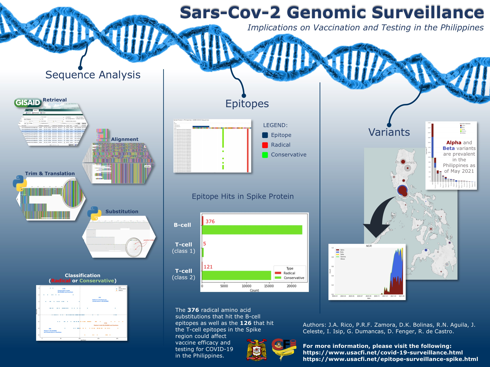
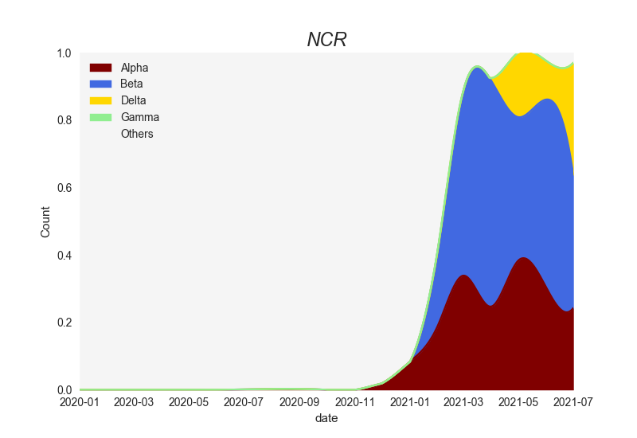

# SARS-CoV-2 Genomic Surveillance and RNASeqAnalysis

SARS-CoV-2 Genomic Surveillance and RNASeqAnalysis (technically DNA) has two components:

1. Variant Surveillance
2. Epitope Surveillance

***
## Variant Surveillance

Variant Surveillance is an additional component of this project to monitor the circulating variants.

#### Run with:

> `python src/SarsCov2Variants.py`  

This will generate csv files in `output/12_variants` and images in `output/11_regions`  
Note that you will need to download the tsv files from GISAID since we are not authorized to redistribute datasets from it.

#### Website
<https://www.usacfi.net/covid-19-surveillance.html>

***
## Epitope Surveillance

Epitope Surveillance aligns multiple COVID DNA sequences, trims the genes of interest, translates to protein, and identifies mutations in epitope regions. Download the entire RNASeqAnalysis folder

#### Example command line to run script:

> `python main.py -i "references/Sequences/omicron_variant" -m "references/Sequences/omicron_variant"`

Optional parameters:

* `-i` directory which contains the fasta files
* `-m` directory which contains the metadata files
* `-ref` reference genome name (Wuhan strain) the default is the name of the first genome in the input fasta file.
* `-aln` TRUE when the input needs alignment and FALSE when the input is already aligned
* `-eps` input text file that lists the epitope regions
* `-loc` input text file that indicates what and where are the relevant reference genes
* `-g` fasta file with only the reference genome
* `-o` output fasta file

#### The program should run with Python 3.6 or later

Input files: 

* `sequences.fasta`
* `metadata.tsv`
* `Reference_gene_locations.txt`
* `NCBI Reference Sequence_NC_045512.2.fasta`
* `epitopes.txt` 

Output files:

* `01_aligned.fasta`
* `02_trimmed.fasta`
* `03_protein.fasta`
* `04_mutations.fasta`
* `05_aminoacid_replacements.csv`
* `06_unique_mutations.csv`
* `07_heatmap_[protein].html`
* `08_table_[protein]_[#].html`
* `09_mutation_geomap.html`
* `10_geoplot_variants.html`
* `11_regions`
* `12_variants`
* `13_filtered_seq_epitsurve.csv`

Fasta files can be viewed using any alignment viewers, e.g. AliView

### Possible Errors:

1. Running the program in Windows or Linux might yield an error when (-aln TRUE). This is because the current MUSCLE and MAFFT programs in the folder are only compatible for MAC computers. 

**Solution**: You can download the MUSCLE/MAFFT programs **compatible to your OS** free online. Or you can change the input parameter (-aln FALSE), but note here that the program assumes that your input file is already aligned.
	
2. An error might come up when you are running in Python 2.

**Solution**: convert the codes into Python 2 or install Python3 (recommended)

3. An error might come up when you don't have the following python modules:
* argparse
* numpy
* pandas
* matplotlib
* itertools
* scipy
* plotly
* datetime

**Solution**: Install the modules using pip in the command line/ terminal: 
pip install [module_name]
